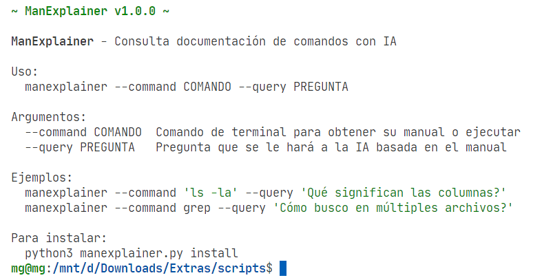
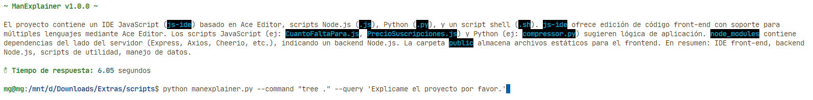
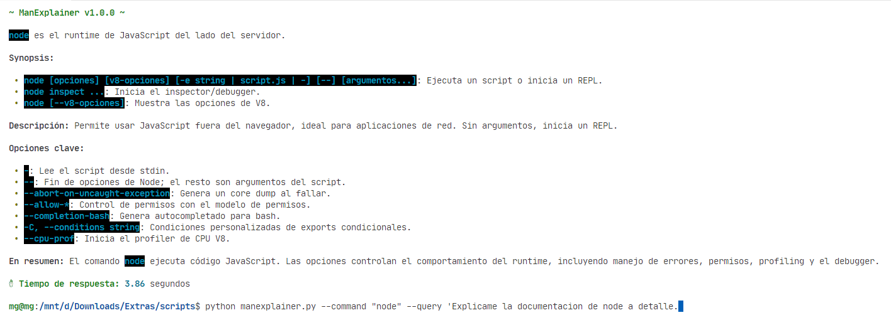

# 🚀 ManExplainer - Tu asistente de terminal con IA



## Ejemplos reales
**1.**


**2.**



> ***ManExplainer** es tu asistente técnico 🤖 que combina la potencia de los manuales Linux (`man`) con la inteligencia artificial de Gemini para darte explicaciones claras y precisas en tiempo real ⚡*

## 🌟 Características principales
- 📖 **Integración perfecta** con manuales de Linux (`man`)
- 🤖 **Explicaciones inteligentes** mediante Gemini AI
- ⚡ **Ejecución directa** de comandos complejos
- 🔄 **Reintentos automáticos** (3 intentos)
- ⏱️ **Timeout configurable** (30 segundos)
- 📊 **Renderizado Markdown** en consola
- 🎨 **Interfaz colorida** con rich.console

## 📋 Requisitos del sistema
- Python 3.10+ (Recomendado 3.11+)
- Cuenta de [Google Gemini](https://aistudio.google.com/)
- Permisos de `sudo` para instalación global
- Dependencias: `rich`, `google-genai`

## 🛠️ Instalación paso a paso

```bash
# 1️⃣ Clonar repositorio
git clone https://github.com/tu_usuario/manexplainer.git
cd manexplainer

# 2️⃣ Instalar dependencias
pip install -r requirements.txt

# 3️⃣ Instalar como comando global (requiere sudo)
python3 manexplainer.py install
```

## ⚙️ Configuración inicial
1. Obtén tu API Key de [Google AI Studio](https://aistudio.google.com/)
2. Edita `manexplainer.py`:
```python
api_key = "TU_API_KEY_AQUÍ"  # 🔑 Línea 43
```
3. *Guarda los cambios*

## 🚀 Modos de uso básico

```bash
# Formato básico
manexplainer --command [COMANDO] --query [PREGUNTA]

# Usando comillas para múltiples argumentos
manexplainer --command "comando -con -argumentos" --query "tu pregunta?"
```

### 💡 Ejemplos prácticos

```bash
# 1️⃣ Consulta sobre comando básico
manexplainer --command ls --query "Cómo listar archivos ocultos?"

# 2️⃣ Análisis de salida de comando
manexplainer --command "ls -l /tmp" --query "¿Qué significa el cuarto campo numérico?"

# 3️⃣ Comando complejo con múltiples flags
manexplainer --command "grep -rnw '/var/log' -e 'error'" --query "Explica cada parámetro usado"

# 4️⃣ Consulta avanzada sobre permisos
manexplainer --command chmod --query "Cómo configuro permisos 755 recursivamente?"
```

## 🎥 Demo en video
[📹 Ver demostración completa](manexplainer.mkv) *(Haz clic para ver el video)*

## 🚨 Solución de problemas

### 🔧 Error durante instalación
```bash
# Si fallan los permisos:
chmod +x manexplainer.py
sudo python3 manexplainer.py install
```

### 🌐 Problemas de conexión API
- Verifica tu conexión a Internet
- Revisa tu cuota en [Google AI Studio](https://aistudio.google.com/)
- Confirma que la API Key sea correcta

### 🐍 Errores de Python
- Actualiza pip: `python3 -m pip install --upgrade pip`
- Reinstala dependencias: `pip install -r requirements.txt --force-reinstall`

## 📜 Licencia
📄 MIT License - Ver [LICENSE](LICENSE) para detalles completos

> **💡 Nota importante:** La calidad de las respuestas depende del modelo Gemini y de cómo formules tu pregunta. ¡Sé específico para mejores resultados! 🎯
